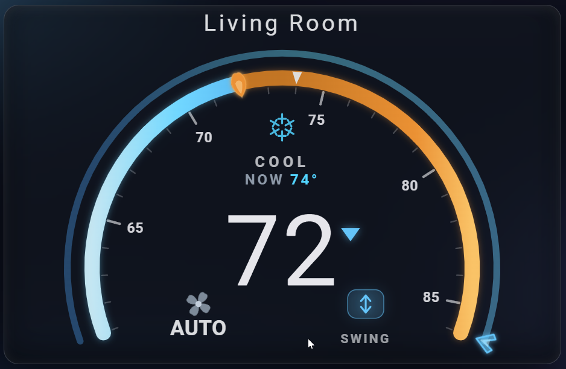

# Climate Cluster Card

An automotive instrument-cluster dial for any Home Assistant `climate.*` entity. Drag temperature on the inner ring and fan speed on the outer ring, tap the center for a glass mode popup with swing / LED / sound toggles.

Built for and tested with Midea units via `midea_ac_lan` (it auto-discovers the sibling fan-speed, swing, LED and beep entities), but works with any `climate.*` entity. Single vanilla file, full GUI editor, Fahrenheit or Celsius, no dependencies and no build step.

- Two-ring drag control (temperature + fan speed)
- Glass mode popup with swing / LED / sound chips
- Numbered scale, NOW marker, animated fan clover
- Full visual editor - no YAML required

Full documentation, screenshots, options and examples are in the [README](https://github.com/rickyfont94/climate-cluster-card#readme).
